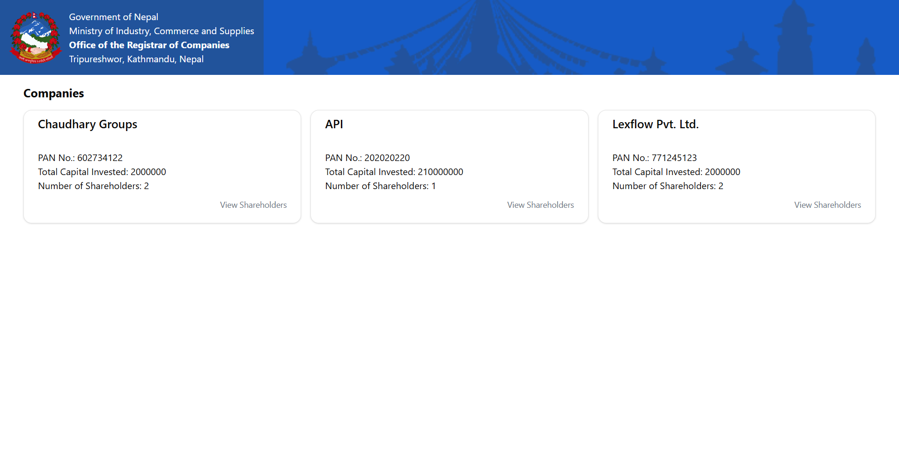
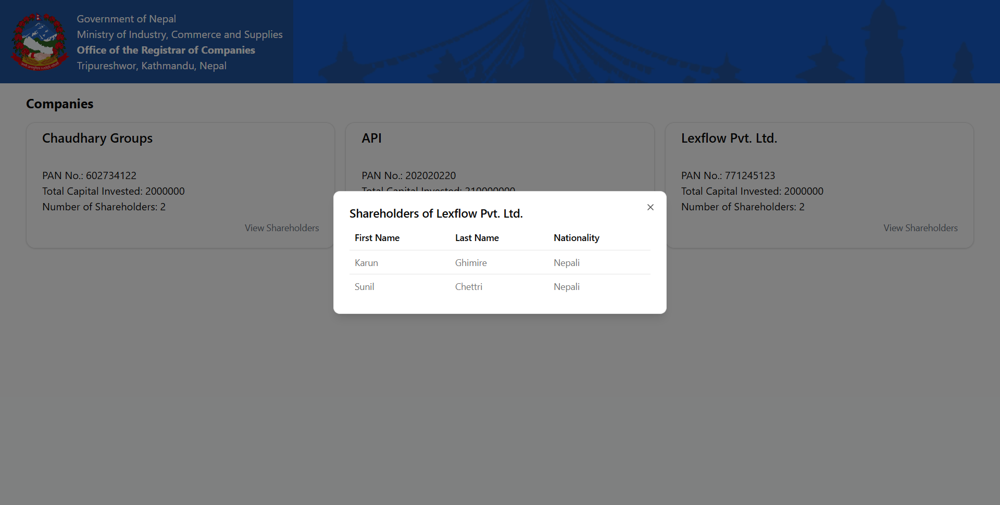

# Full Stack Company Incorporation Tool 

A **full-stack application** for company incorporation that allows users to:

- Fill multi-step forms to register a company  
- Save drafts of company information  
- Add multiple shareholders  
- View all companies and their shareholders via an admin interface  

---

# Project Installation Guide

## 1. Clone the repository

```bash
git clone https://github.com/KarunJr/multi-step-form.git
cd multi-step-form
```

## 2. Install backend dependencies
```bash
cd backend
npm install
```
## 3. Install frontend dependencies
<small>Open another CMD (or just go back to the main folder):</small>
```bash
cd ../frontend
npm install
```
### 4. Run the backend in development

Go back to the backend folder:

```bash
cd ../backend
npm run dev
```

### 5 Run the frontend in development
<small>Go to the frontend folder:</small>

```bash
cd ../frontend
npm run dev
```

# Screenshots

### Home Page


---

### Register Company Page


---

### Second Form Page


---

### Companies Page


---

### Shareholder Details
